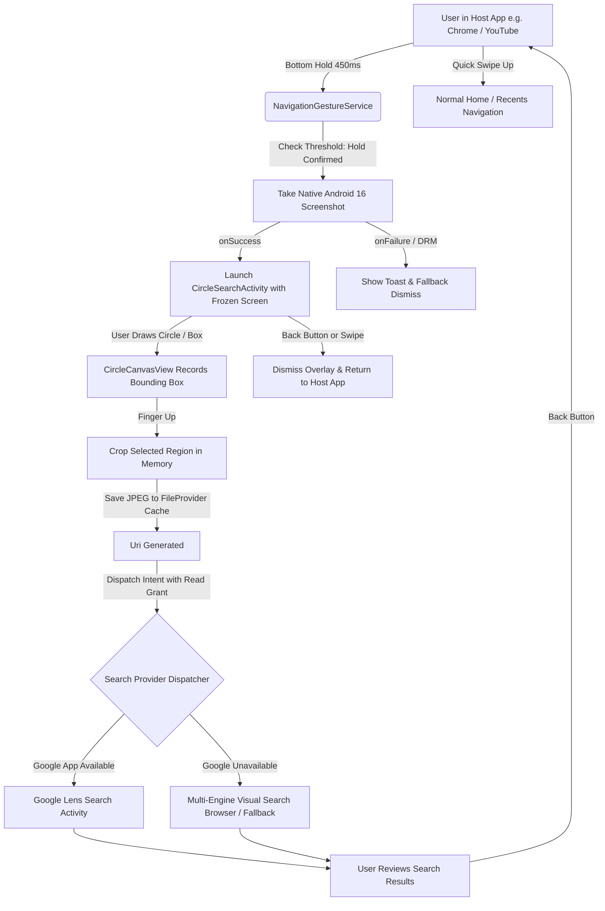

# Application Interaction Flow (AppFlow)

```mermaid
flowchart TD
    A[User in Host App e.g. Chrome / YouTube] -->|Bottom Hold 450ms| B(NavigationGestureService)
    A -->|Quick Swipe Up| NAV[Normal Home / Recents Navigation]
    
    B -->|Check Threshold: Hold Confirmed| C[Take Native Android 16 Screenshot]
    C -->|onSuccess| D[Launch CircleSearchActivity with Frozen Screen]
    C -->|onFailure / DRM| E[Show Toast & Fallback Dismiss]
    
    D -->|User Draws Circle / Box| F[CircleCanvasView Records Bounding Box]
    D -->|Back Button or Swipe| G[Dismiss Overlay & Return to Host App]
    
    F -->|Finger Up| H[Crop Selected Region in Memory]
    H -->|Save JPEG to FileProvider Cache| I[Uri Generated]
    I -->|Dispatch Intent with Read Grant| J{Search Provider Dispatcher}
    
    J -->|Google App Available| K[Google Lens Search Activity]
    J -->|Google Unavailable| L[Multi-Engine Visual Search Browser / Fallback]
    
    K --> M[User Reviews Search Results]
    L --> M
    M -->|Back Button| A
```

